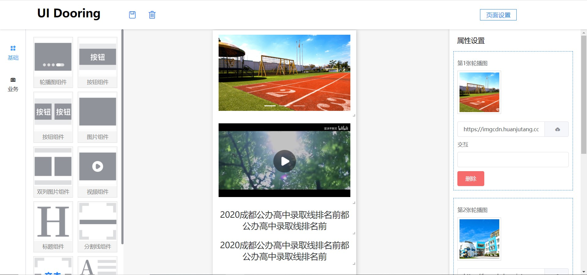

<h1 align="center">UI Dooring 👋</h1>

### 概述

> UI Dooring是一款功能强大，专业可靠的H5/小程序可视化页面配置解决方案，致力于提供一套简单方便、专业可靠、无限可能的H5/小程序落地页最佳实践。技术栈以vue为主,配置页面所见即所得。

### 功能截图


---

### 快速开始
1. 安装 `vue-cli`
    ```shell
    $> npm install vue-cli -g
    ```

2. 安装环境依赖
    + `npm` 安装
    ```shell
    $> npm install
    ```

    + `yarn` 安装
    ```shell
    $> yarn
    ```

3. 编译项目

    编译项目
    ```shell
    npm run dev
    ```

---

### 技术栈 | The technology stack
* **Vue** 前端主流框架(vue,react,angular)之一,更适合开发灵活度高且复杂的应用
* **vuex** 主流的Vue应用状态管理工具
* **sass** css预编译语言，轻松编写结构化分明的css
* **ElementUI** 地球人都知道的ElementUI组件库
* **axios** 强大的前端请求库
* **formCreate** 基于schema的优秀的表单设计器
* **vuedraggable** 基于Vue的拖拽组件
* **vue-grid-layout** 基于Vue的拖拽布局组件

---

### 预览功能 | Preview features
>开发中...

---

### wiki(参考文档)

* [vue 开发文档](https://cn.vuejs.org/index.html)
* [vuex 开发文档](https://vuex.vuejs.org/zh/)
* [uniapp 开发文档](https://uniapp.dcloud.io/collocation/pages)
* [sass 使用文档](https://sass.bootcss.com/documentation)
* [chai 开发文档](https://www.chaijs.com/)
* [mocha 开发文档](https://mochajs.cn/)
* [lerna 使用文档](https://github.com/lerna/lerna)
* [Vuese/cli 使用文档](https://vuese.org/zh/cli/)
* [formCreate 使用文档](https://github.com/xaboy/form-create)
* [vuegridlayout 使用文档](https://github.com/jbaysolutions/vue-grid-layout)
* [vueDraggable 使用文档](https://github.com/SortableJS/Vue.Draggable)

---

### 已完成功能 | The functionality is complete
+ 轮播图组件
+ 图片组件(单列/双列)
+ 按钮组件(单列/双列)
+ 富文本组件
+ 标题组件
+ 视频组件
+ 分割线组件(有文本/无文本)
+ 学校列表组件
+ 小区列表组件
+ 文章列表组件

---

### 计划功能

+ 预览
+ 上一下/下一步
+ 服务化

---

### 目录说明

    |-- src
        |-- api 接口
        |-- components 公共组件
        |-- core 渲染引擎
        |-- mixins 差异化mixin
        |-- materials 页面
            |-- base 基础组件
            |-- busi 业务组件
        |-- pages 神策埋点与分享的插件
            |-- editor 编辑页面
            |-- home   首页
        |-- router 路由
        |-- store vuex store
            |-- modules sotre模块
        |-- utils 工具类库
            |-- lib 依赖库
                |-- http 请求模块
                |-- cloneDeep.js 深拷贝
                |-- type.js 类型判断
                |-- util.js 工具库
        |-- App.vue app入口
        |-- main.js js入口
    |-- test 测试用例
    |-- .env 默认的环境变量 (必须以**VUE_APP_**开头)
    |-- .env.**_dev 开发环境的环境变量
    |-- .env.**_dev.local 开发环境的本地环境变量
    |-- .eslintrc.js eslint配置
    |-- .huskyrc git提交配置
    |-- vue.config.js vue配置文件

---

### 开发规范
+ 遵守《开发准则》
+ 遵守《ESLint规范》
+ 一起共同维护此项目

---

### 开发准则（纠结癌必备）
1. 和环境有关配置写入`env`
2. 所有配置需要写入到`sotre/modules/settings`，应用内统一使用`vuex`访问
4. 公共模块:（分包和主包同时需要）放`src/components`目录

---

#### ESLint 规范

+ airbnb 规范
+ vue 官方规范

---

## git提交规范

feat: 新功能（feature）

fix: 修补bug

docs: 文档（documentation）

style: 格式（不影响代码运行的变动）

refactor: 重构（即不是新增功能，也不是修改bug的代码变动）

test: 增加测试

revert: 回滚

config: 构建过程或辅助工具的变动

chore: 其他改动

项目内置两种提交方式，前提必须保证规范一致

+ 使用 `git cz` 或者 `npm run commit`（推荐）

``` bash
npm run commit
```

+ 使用 `sourcetree` 或者 `github desktop`

---

## 版本日志 | Version the log
1. 1.0版本(10个基础组件2个业务组件)

